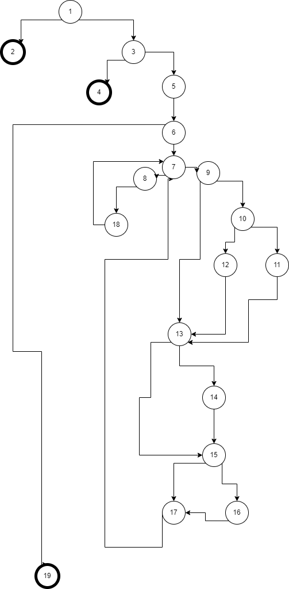
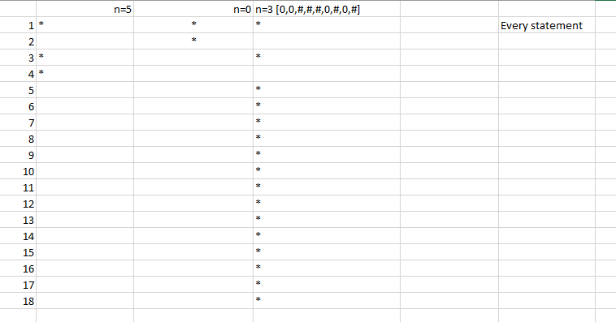
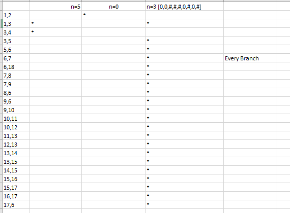

# Втора лабораториска вежба по Софтверско инженерство
## Кристијан Лазаровски 153071

## Control Flow Graph

## Цикломатска комплексност
Цикломатската комплексност е 8, истата ја добив преку формулата P+1, каде што P е бројот на предикатни јазли. Во случајoв P=7, па цикломатската комплексност изнесува 8.
## Тест случаи според критериумот Every Statement

## Тест случаи според критериумот Every Branch

